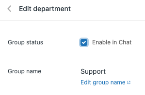
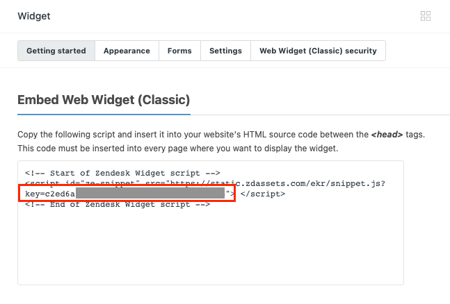
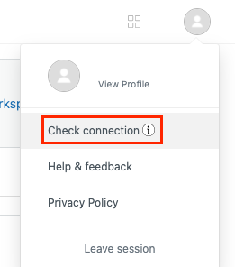

# ZENDESK CHATBOT ADAPTER
 
## TABLE OF CONTENTS
* [Description](#description)
* [Functionalities](#functionalities)
* [Installation](#installation)
* [Configuration](#configuration)
    * [Inbenta Backstage Instance](#inbenta-backstage-instance)
    * [Zendesk Adapter](#zendesk-adapter)
    * [Zendesk Widget](#zendesk-widget)
* [Example](#example)
* [Dependencies](#dependencies)
 
## DESCRIPTION
This adapter overwrites the way the Inbenta bot starts a chat. Specifically, instead of starting a chat on the standard Hyperchat (Inbenta chat product), it does so with the Zendesk widget.
This means that when the user wants to start a chat to an agent, the adapter closes the chatbot and loads the Zendesk widget using the [Zopim](https://api.zopim.com/files/meshim/widget/controllers/LiveChatAPI-js.html) and [Zendesk WEB-SDK](https://api.zopim.com/web-sdk/).

You can find a configurated and functional **example of this adapter** in `./example/index.html`.

## FUNCTIONALITIES
Currently, the features provided by this application are:
* Escalate to Zendesk chat using the zendesk widget.
* Manage open/close from both chatbot and Zendesk chat.
* Send the next chatbot variables: EMAIL, FIRST_NAME, LAST_NAME, INQUIRY. 
* Go back to Inbenta chatbot once user finishes to talk with an agent.

## INSTALLATION
In order to add this adapter to your SDK, you need to import the files `/src/zendesk-adaper.js` into your HTML/JS file where you're building the SDK. Then, append it to the SDK adapters array providing the adapter configuration as shown in the [example](#integration-example) section.
More information on how to integrate Inbenta adapters [here](https://developers.inbenta.io/chatbot/javascript-sdk/sdk-adapters).

## CONFIGURATION
This section contains the configuration of 3 components:
* Inbenta Backstage Instance
* Zendesk Adapter
* Zendesk Widget
 
### Inbenta Backstage Instance
On the contact form you will have to set up the next variables:
* name &rarr; FIRST_NAME (required)
* last name &rarr; LAST_NAME (optional)
* email &rarr; EMAIL_ADDRESS (required)
* reason &rarr; INQUIRY (optional)

#### How do we use these variables?
These variables are used in the adapter to send all the user information to the zendesk chat, in this way we can:
* Set up name and email in case there is no pre-form activated on Zendesk 
* Fill the Zendesk preform fields with the values that the user has already defined in the Bot.

### Zendesk Adapter
Below is the necessary configuration for the adapter and the definition of the different properties:

```javascript
// Zendesk Adapter conf
zendesk: {
    zopim: {
      preForm: false,
      getUserInfo: true,
      sendTranscript: true,
      department: '',
      accountKey: '<ZENDESK_ACCOUNT>',
      labels: {
        placeholder: 'We are processing your request, sooner you will be redirected to Zendesk chat.',
        defaultInitialUQZendesk: 'Hello',
        ticketCreationSuccess: 'Your ticket was created, we will contact you as soon as possible',
        ticketCreationError: 'An error occurred, try again later'
      },
      launcherDivSelector: '.inbenta-bot__launcher',
      subdomain: '<ZENDESK_SUBDOMAIN>'
    }
}
```
* `preForm`(bool): Allows the user to decide if there will be a preform in the Zendesk widget or it will escalate directly. This value must be the same as that defined in the Zendesk widget settings.
* `getUserInfo`(bool): Allows the user to obtain the information of the user who is in the Inbenta chatbot, this information will be used by Zendesk to identify the user or complete the preform in Zendesk (according to the previous parameter).
* `sendTranscript`(bool): Allows the user to send the chat transcript from Inbenta to Zendesk widget. This way, the agent in Zendesk can see all the previous conversation mantained with the bot.
* `department` (string): Optional value. Name of the department to validate the availability of the agents.
* `accountKey`(string): The account key of your Zendesk application. If it is not present, the adapter will throw an error.
* `labels`(object):
    * `placeholder`(string): This param is used to show a placeholder while Inbenta is doing the transition between the chatbot and the Zendesk widget.
    * `defaultInitialUQZendesk`(string): Initial question sent to zendesk when you open chat in case no inquiry was set in the inbenta escalation form. This configuration allows to start the chat automatically.
    * `ticketCreationSuccess` (string): Message when a ticket is created
    * `ticketCreationError` (string): Error message when a ticket is not created
* `launcherDivSelector` (string): This param is used to get inbenta launcher element chat. Default is: '.inbenta-bot__launcher'
* `subdomain` (string): Zendesk subdomain 

### Zendesk Widget
The configuration of the widget must be done according to the configuration of the adapter.
This means that if you do not set the widget to have a preform, even if you set the `preForm` property to true, it will not show because the Zendesk settings prevails.

### Agents Availability
If you don't provide a specific department, when users try to escalate the adapter will search all the available agents in every department. This search is possible if you "**Enable in Chat**". On your Zendesk Portal, go to "Settings &rarr; Departments" and edit every department that you want to be checked with this option:



### Zendesk Ticket Creation
If there are no agents available, the process of the creation of a Zendesk ticket will be triggered. In Inbenta Backstage validate you have a "No Agents Available" intent in the "Offer escalation" dialog. This intent should have a "Direct Call": **escalationNoAgentsAvailable**.

The "No Agents Available" intent should have a dialog to an intent to start a ticket form ("Create Ticket Form"). By default the used variables are 4: _FIRST_NAME_, _LAST_NAME_, _EMAIL_ADDRESS_, _INQUIRY_.

The "Create Ticket Form" intent should execute a _Callback_ called **createTicket**. Go to "**Knowledge Base → Actions**" to validate if this callback exists. If not, create it with the _function name_ **createTicket** and adding it in **Parameters** the same variables used in the form of "Create Ticket Form" intent.

Once everything is properly configured in Inbenta Backstage, add the name of the **subdomain** in your Zendesk adapter configuration ([Zendesk Adapter](#zendesk-adapter))

## EXAMPLE
As commented before, there is an example in `./example/index.html`. To make it work, you will need to replace the value <KEY>:
``` html
<script id="ze-snippet" src="https://static.zdassets.com/ekr/snippet.js?key=<KEY>"> </script>
```

To find this value you should go to **Settings -> Widget**, on the Zendesk portal. There you can find a code snippet, copy the **key** value that appears in the script tag:



Additionally to the `Key` of the previous step, you need to add the `accountKey` (in the javascript Zendesk addapter config). This value can be found in the **"Check connection"** section on the Zendesk portal. Access is from the user menu and the property is called **"Account key"**.



And set up the Inbenta variables related to your chatbot instance.
* inbentaKey: This value can be found in the **Administration > API** section in Backstage and is called the API key.
* domainKey: This value can be found in the **Administration > API** section in Backstage and is called the Domain key.

## DEPENDENCIES
This adapter has been developed:
 * Using the `web-sdk.js` dependency included in the `src/` folder as a **static resource**.
 * Using Chatbot SDK version **1.39.0**
